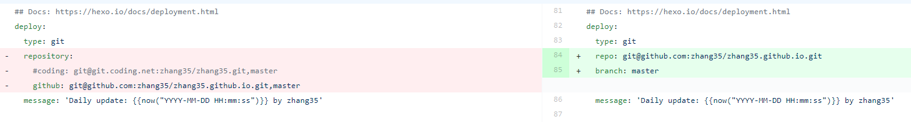
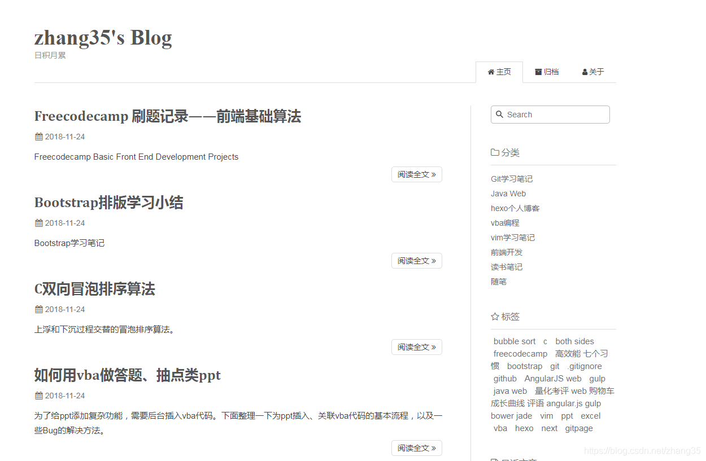
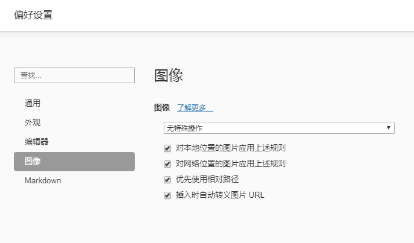
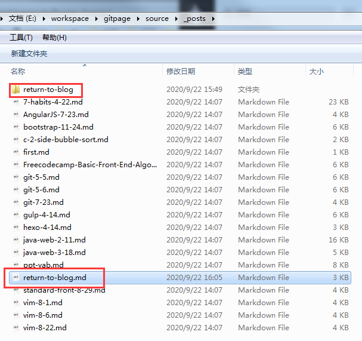
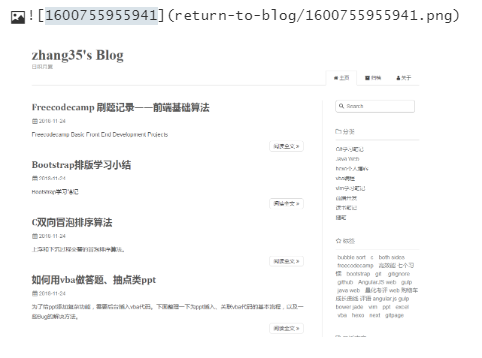
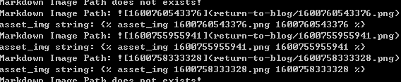

---

title: 我回来了
date: 2020-09-22 14:25:37
categories: hexo个人博客
tags: 
- hexo
- maupassant
- gitpage
toc: true
description: 开始重新更新个人博客，每周至少一篇，看能坚持多久。
---

距离上次发表个人博客，差不2年了。那是离开涿州的前夕，命运在那时发生了巨变。

这两年来尝到了“钱多事少离家近”的安逸，也尝到了失去一切的落差；得到了梦寐以求的自由，也体会到了自由的代价。

但无论如何，我去到了理想的城市，开始从事理想的工作，还好一切都来得及。

写博客对于学习积累至关重要，有个个人主页方能彰显程序员的逼格，于是又拾起了荒废已久的gitpage。

不出所料，遇到一堆神奇的bug，足足花了约5个小时才成功解决。下面记录一下回归历程。


## 更换主题

大道至简，选择了[maupassant-hexo](https://github.com/tufu9441/maupassant-hexo)主题。直接git clone到theme文件夹，更改`_config`文件即可，本地预览效果良好。

相比CSDN、简书等博客站点的优点有：

1. 无广告
2. 可定制
3. 有一个search框，方便检索文章

本地`hexo g`生成，`hexo s`开启本地服务查看，效果不错。


## 部署到GitPage报错的Bug解决之路

### 环境介绍

hexo源文件仓库名：`gitpage`

gitpage主页仓库名：`zhang35.github.io`

### 部署到git的Bug

本地网页预览的好好的，执行`hexo d`部署到git上后，发现gitpage直接刷不出来了，很快就收到了Github的邮件报错：

第一个：

#### You are attempting to use a Jekyll theme, "maupassant", which is not supported by GitHub Pages

主题问题？

网上查到的解决方法：手动修改了`github.io`仓库里`_config`，去掉theme:maupassant`一行；

然后迎来第二个报错：

#### The value '{}' was passed to a date-related filter that expects valid dates in `/_layouts/default.html` or one of its layouts. For more information, see https://docs.github.com/github/working-with-github-pages/troubleshooting-jekyll-build-errors-for-github-pages-sites#date-is-not-a-valid-datetime.

解决方法：

网上查到的解决方法：没有用jekyll时，在`github.io`仓库根目录建立名为`.nojekyll`的空文件，以跳过jekyll检查。

然后没有报错了，取而代之的是：

#### 404 not found：找不到index.html

查看了`github.io`仓库，发现的确没有index.html，里面存的是`gitpage`仓库的源文件，而不是生成的html页面。

找遍了网上答案，无果。

直到尝试直接把hexo生成的public文件夹的内容手工上传到github.io，发现是可以访问的！


那么问题就出在hexo的deploy了。

直接谷歌hexo deploy，在hexo官网上找到了答案：

[hexo gitpage 部署](https://hexo.io/zh-cn/docs/github-pages)

写的很清楚：

1. 安装 [hexo-deployer-git](https://github.com/hexojs/hexo-deployer-git).

2. 在 **_config.yml**（如果有已存在的请删除）添加如下配置：

   ```
   deploy:  type: git  repo: https://github.com/<username>/<project>  # example, https://github.com/hexojs/hexojs.github.io  branch: gh-pages
   ```

3. 运行 `hexo clean && hexo deploy` 。

4. 查看 *username*.github.io 上的网页是否部署成功。

   

对比自己的`_config`文件，发现语法格式貌似不大对，以前的写法可能过时了。

于是将`deploy`标签内的`repository`改成了`repo`，`branch`另起一行，修改如下：




重新hexo g -d，成功向Github上传了生成的html文件，gitpage终于正常了！！！




经验教训是：**多看官方文档，注意版本变化**。


## Typora编辑器

为了更好地写博客，找到了能方便插图的Markdown编辑器——Typora，支持CTRL+V将图片粘贴为Markdown格式。

首先在设置中勾上“优先使用相对路径”：



在Hexo根目录_config.yml中启用`post_asset_folder: true`选项，以便执行`hexo new`能自动为文章创建同名文件夹，用来存放图片等：




在Typora中粘贴图片后选择“复制图片到”文章同名文件夹中，使用如下相对路径：xxx/yyy.png



再使用[hexo-image-link](https://github.com/cocowool/hexo-image-link)，可以在执行`hexo g`时，将Markdown语法的图片路径转换为`asset_img`的方式，使图片能够在使用typora编辑和hexo预览发布时都能正常显示。


### 测试

按上面步骤编辑好新的带有图片的Markdown文章后，执行`hexo g`生成；

执行`hexo s`打开本地服务器预览；

能看到以下提示：



以后每当新插入图片，保存编辑时，也能看到打印如上图信息，预览网站也会实时变化。


## 结语

开始重新更新个人博客，每周至少一篇，看能坚持多久。